# WARNING
# This is a copy of the relative AWS CodeCommit repository due to the non easy CodeCommit share.


### CodeComit repository name : ecf_bancash_front
### GitHub    repository name : ecf_bancash_front

# Activité Type 2 : Déploiement d’une application en continu

Included tasks :
4. Créez une application Angular (hello word)
5. Écrivez le script qui build/test et le Angular


## In shorts words :
<p>I demonstrated hows to place a CI/CD simple pipline with AWS tools. Because we need a application, i made a Hello Word Angular new project.</p><br>
I will often talk about a buildspec file. This is a normalised formated yaml file who describe fundamental phases : 

- install (set up libraries needed in the environement)
- pre_build (unit test for exemple)
- build (some projects needs to be compiled for exemple)
- post_buid (send the artafact to a target)

### What I done :


1. Continuous Integration mean a GIT repository. For that, i used AWS CodeCommit as it. On local machine, i created special a ssh key dedicated for CodeCommit and published this key to my AWS user profil page settings and in the .ssh/config local file.<br><br>Ok, link between my local GIT command and AWS CodeCommit is set.<br><br>
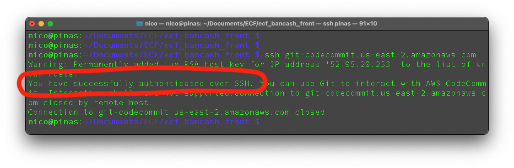

3. I created a new "ng new bancash_front" Angular project. For that, nodejs package and obvioulsy, the Angular framework are required. I am on a GNU/Linux Debian derived system (Raspberry Pi OS) :
```
sudo apt update && sudo apt ugrade
sudo apt install nodejs
npm install -g @angular/cli

ng new bancash_front
ng install # Install dependencies
```

Our new app is here.

3. Here, I use a S3 bucket as a artefact remote target. In the buildspect file, after the build phase, post_build will send the artefact to my "ecfbancashfront" S3 bucket.<br><br>
At the S3 creation, we need to activate the public access, the enbeded web server (a endpoint url is now given) and then, add a policy for allow a public read of things inside the bucket.<br>
Policy to add :
```
{
    "Version": "2012-10-17",
    "Statement": [
        {
            "Sid": "PublicReadGetObject",
            "Effect": "Allow",
            "Principal": "*",
            "Action": "s3:GetObject",
            "Resource": "arn:aws:s3:::ecfbancashfront/**"
        }
    ]
}
```
<br>
<b>S3 endpoint (worked, try it please) : http://ecfbancashfront.s3-website-us-west-2.amazonaws.com</b>
<br><br>

4. Continuous Delivery is a software development methodology where the release process is automated (for dev, test or production deployment). Every software change is automatically built, tested, and deployed to production.<br>
I used AWS Codebuild for that! It provides a automated deployment using a builspec.yaml script file (buid specification) placed at the repos's root directory.<br><br>
My "bancash_build" Codebuid build process have some required configuration :
- Source provider (of code) : From my ecf_bancash_front CodeCommit repo
- Environment      : I choosed a AmazonLinux2-x86_64-standard:5.0 IAM machine. This is our real build environment where the buildspec.yml will run. It is a EC2 machine finaly.
- Buildspec file   : Set as a buildspec file is used
- Artefact         : The build result. I specifyed my S3 "ecfbancashfront" bucket
- S3 Logs          : Artefacts builds generations are stored in the ecfbancashfront S3 bucket (in /log_build/ folder). It is very usefull for debugging the buildspec file.
 
<br>

### "bancash_build" Codebuid policy
Our CodeBuild process needs all the rights to use the S3 target.<br>We must add this in the role of the Codebuild generation profil:
```
        {
            "Effect": "Allow",
            "Resource": [
                "arn:aws:s3:::ecfbancashfront/*",
                "arn:aws:s3:::ecfbancashfront"
            ],
            "Action": [
                "s3:PutObject",
                "s3:GetObjectAcl",
                "s3:GetObject",
                "s3:DeleteObjectVersion",
                "s3:GetObjectVersionAcl",
                "s3:ListBucket",
                "s3:DeleteObject",
                "s3:PutObjectAcl",
                "s3:GetObjectVersion",
                "s3:ListObject"
            ]
        },
```
My CodeBuild generation project :
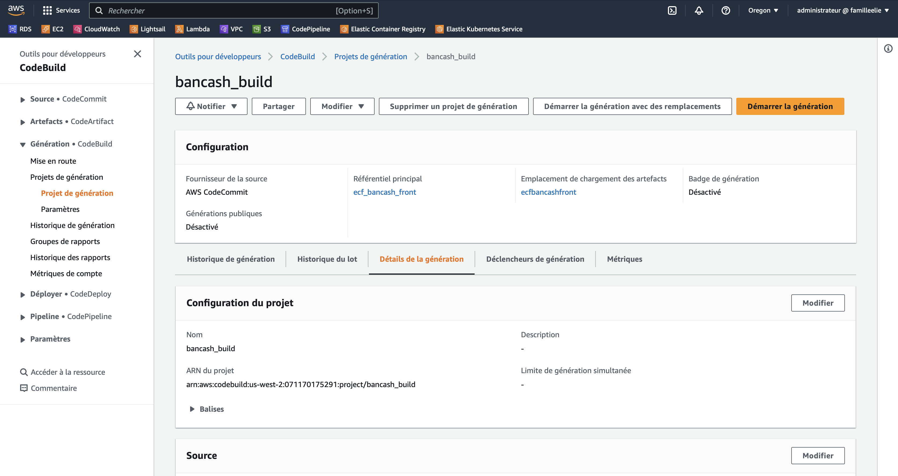
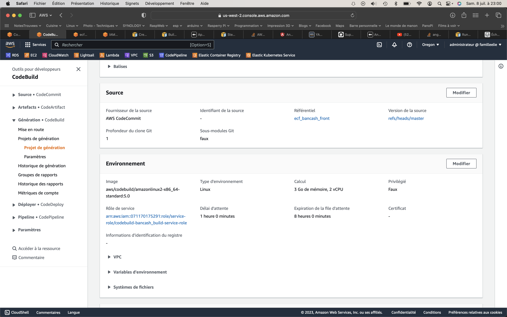
<br><br>
CodeBuild SUCCESS generation status (after a manual exec) :

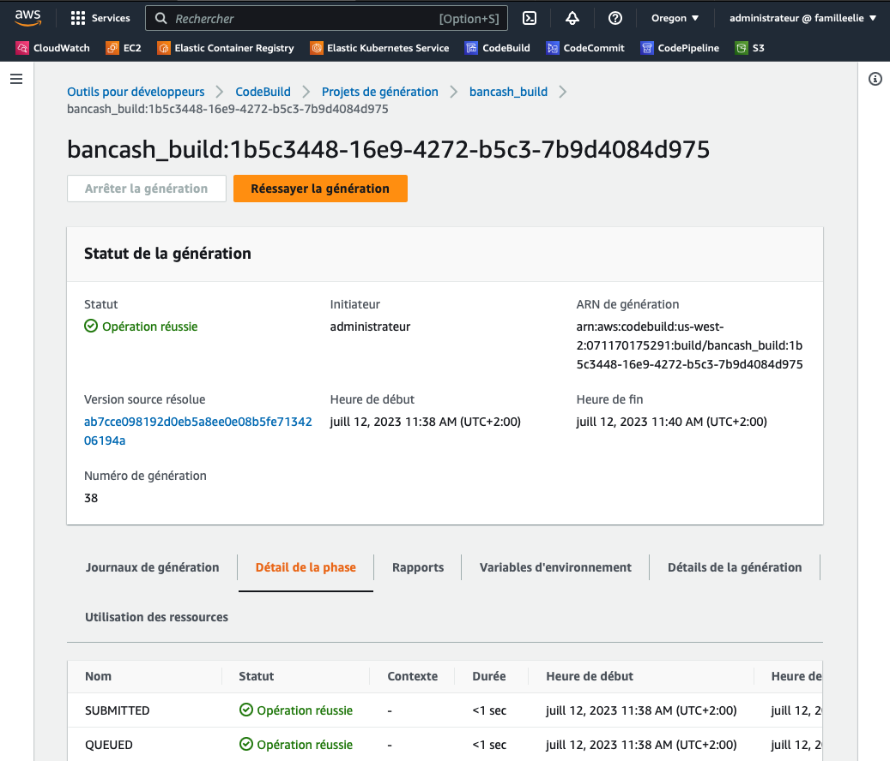
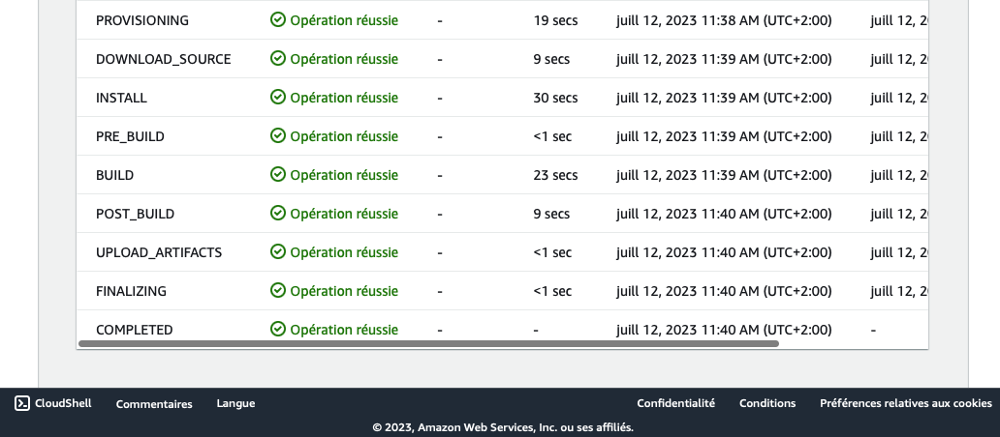
<br>

5. CodePipeline : the final step 

The GOAL in CI/CD is to provide a automatic workflow from a commit in the main branch of a projet code repository to a target deployment environment.

<br>

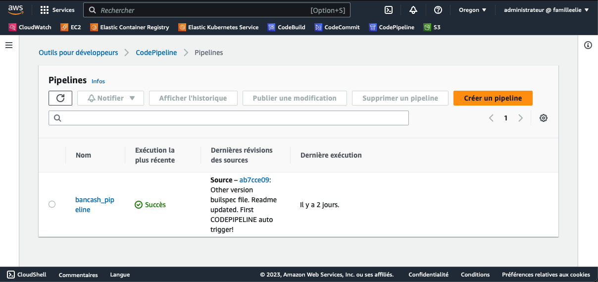

<br>

I created a codepipeline that defines:
- SOURCE : The code repository previously stored on AWS CodeCommit by requesting monitoring of commitments by Cloudwatch.
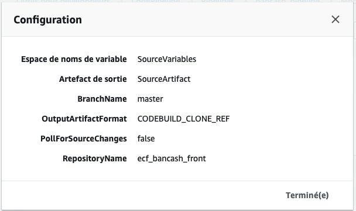
- BUILD : The CodeBuild build generator of our application.
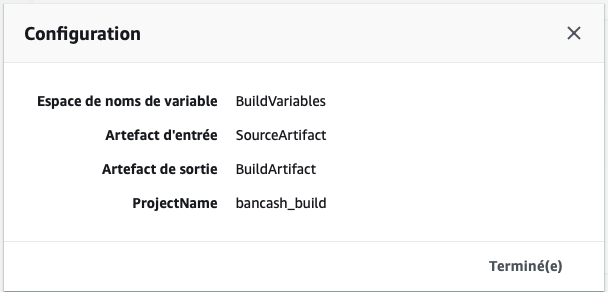
- DEPLOY : The target where our artifact should be sent, I mean the S3 bucket
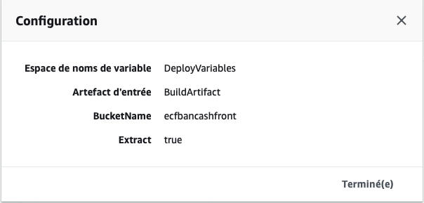


<br><br>
As you can see below, the pipeline works end to end!
A commit named "Other version builspec file. Readme updated. First CODEPIPELINE auto trigger!" was appened on the CodeCommit repo, <b>the pipeline was triggered as expected</b>.

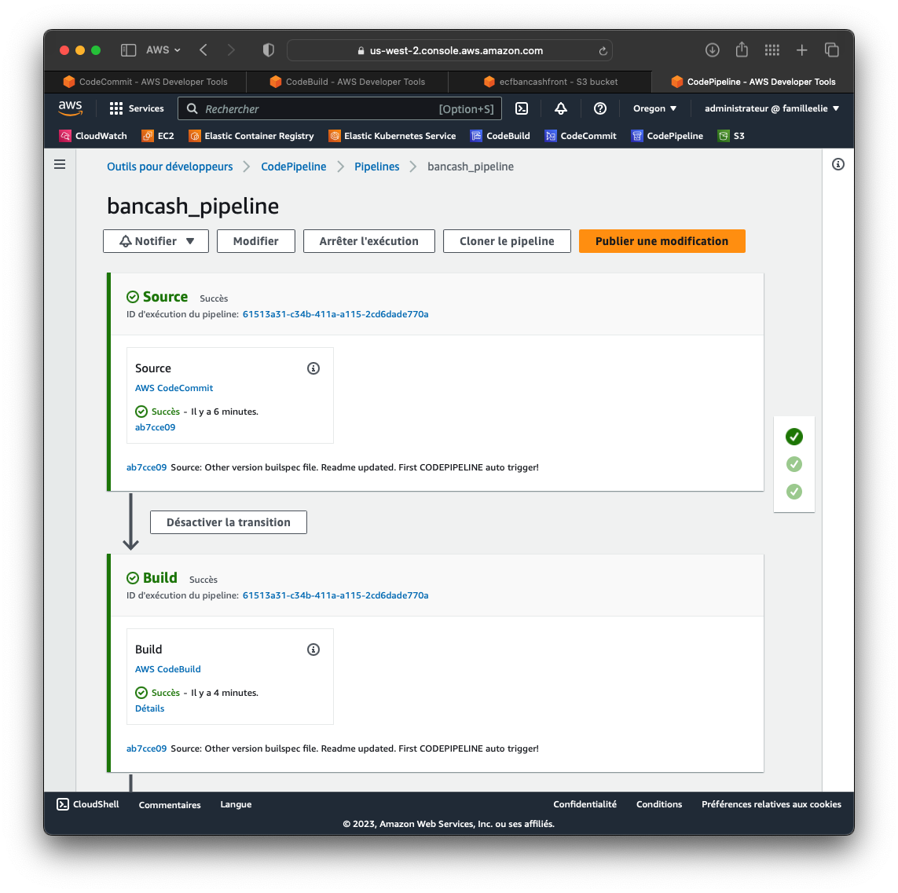
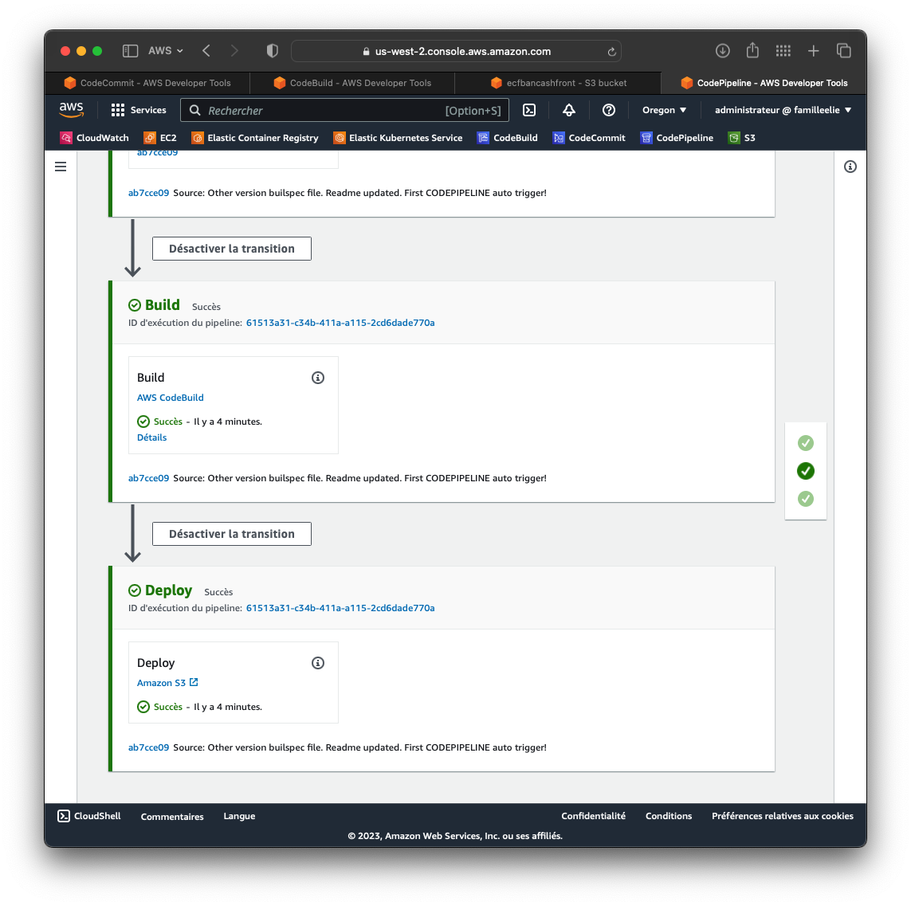
<br><br>
Great, the deployment is UP!
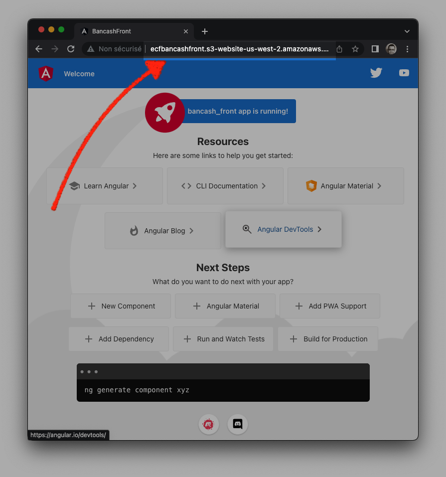

<br><br>
# Thanks for reading.
